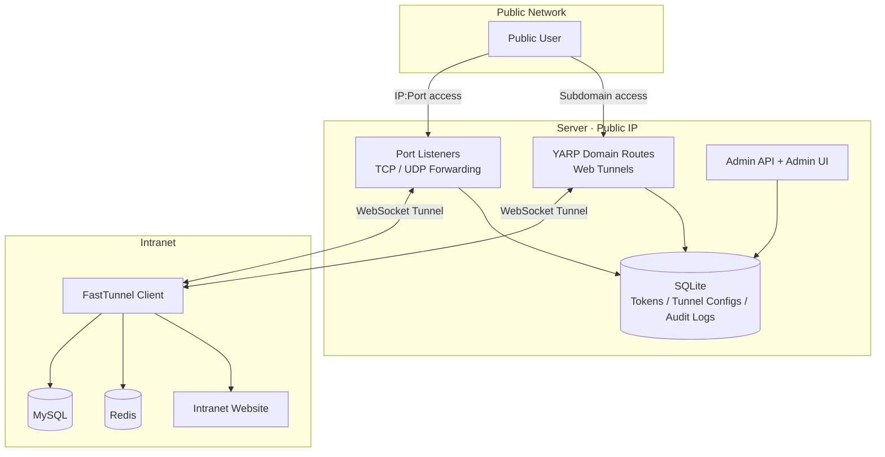
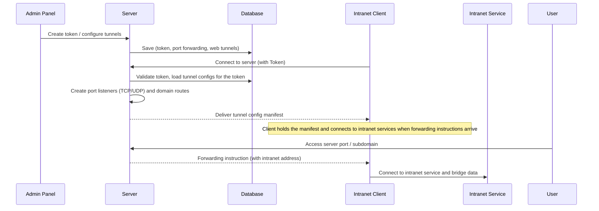

<div align="center">


## FastTunnel

[](https://www.apache.org/licenses/LICENSE-2.0)
[](https://github.com/bambuo/FastTunnel/actions)
[](https://www.nuget.org/packages/FastTunnel.Core/)

[中文文档](README.md) | [Esperanto](README.eo.md)

</div>

## What is FastTunnel

FastTunnel is a high-performance cross-platform intranet penetration tool. With it, you can expose intranet services to the public network for yourself or anyone to access.

- **TCP / UDP port forwarding**: access any intranet service (mysql, redis, ssh, remote desktop, etc.)
- **Web tunnels**: access intranet web services via custom domain names / subdomains (commonly used for WeChat development)
- **Built-in web admin panel**: token management, tunnel configuration, online clients, system settings, and audit logs
- Unlike other penetration tools, FastTunnel is committed to being an easy-to-extend, easy-to-maintain intranet penetration framework. You can build your own penetration application by referencing the `FastTunnel.Core` NuGet package.

> ⚠️ When exposing port 3389 (remote desktop), make sure your system password is strong enough to prevent unauthorized access.

## Features

- [x] Remote access to intranet computers (Windows / Linux / Mac)
- [x] Custom domain access to intranet web services
- [x] TCP / UDP port forwarding (bidirectional UDP datagram forwarding)
- [x] Multiple domains bound to intranet services
- [x] Client Token authentication (tokens are created in the admin panel; unauthenticated tokens are rejected)
- [x] Server-managed tunnel configuration: zero client-side config, all managed in the admin panel, changes take effect immediately
- [x] Client environment reporting (OS / CPU / memory / .NET version)
- [x] Visual system settings (root domain, port forwarding toggle, JWT, etc., hot-reloaded on save)
- [x] Operation audit logs
- [ ] p2p penetration

## Architecture



**Login & Config Delivery Flow**



| Project | Description |
|---|---|
| `FastTunnel.Server` | Server (deployed on a machine with a public IP), hosts admin API and admin UI |
| `FastTunnel.Client` | Client (deployed on intranet machines), actively connects to the server |
| `FastTunnel.Core` | Core framework library (published to NuGet for secondary development) |
| `FastTunnel.Core.Client` | Client core library |
| `FastTunnel.Api` | Admin API (tokens, tunnels, online clients, system settings, audit logs) |
| `FastTunnel.Admin` | Admin UI (Vue 3 + Arco Design) |

## Screenshots

**Dashboard**


**Tokens** (created in the admin panel; clients must carry a valid token to log in)


**Web Tunnels**


**Port Forwarding** (TCP / UDP)


**Online Clients** (live connections with environment info)


**Audit Logs**


**System Settings**


## Quick Start

### 1. Deploy the server

```bash
# Development (listens on http://*:1270 by default)
dotnet run --project FastTunnel.Server

# Or publish
./publish.sh
```

Server data is stored in `data/fasttunnel.db` (SQLite, under the app directory: accounts, tokens, tunnel configs, audit logs).

### 2. Initialize the admin panel

Open `http://server-ip:1270` in a browser. On first use, the setup page creates the admin account (TOTP two-factor verification supported).

### 3. Create a token and tunnels

1. **Tokens** → create a token (e.g. `ft-demo-token`)
2. **Web Tunnels** → create (subdomain + intranet service address, bound to a token)
3. **Port Forwarding** → create (remote port + intranet address + TCP/UDP protocol, bound to a token)

Tunnel changes take effect immediately; if the target client is offline, the config is applied automatically when the client logs in.

### 4. Configure and start the client

Only three settings are needed in `FastTunnel.Client/appsettings.json`:

```json
{
  "FastTunnel": {
    "Server": {
      "ServerAddr": "server-ip-or-domain",
      "ServerPort": 1270
    },
    "Token": "ft-demo-token"
  }
}
```

```bash
dotnet run --project FastTunnel.Client
```

Once connected, the server automatically creates port listeners and domain routes based on the admin config. Access intranet services via `server-ip:remote-port` or `subdomain.root-domain:1270`.

### 5. System settings

The **System Settings** page manages server parameters (hot-reloaded on save):

- **Enable port forwarding**: when disabled, the server stops handling port forwarding
- **Root domain**: subdomain suffix for web tunnels (e.g. `test.cc`)
- **JWT auth**: admin panel login token parameters (changes require a server restart)

## Security Notes

- The default JWT signing key is a built-in default; change it in System Settings for production
- Tokens and tunnel configs are stored in the server database; protect server access
- Use strong passwords when exposing ports such as 3389 / 22

## License

Apache License 2.0
