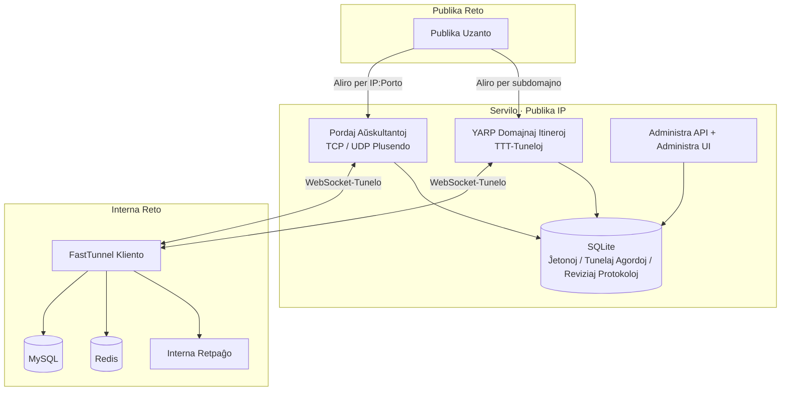
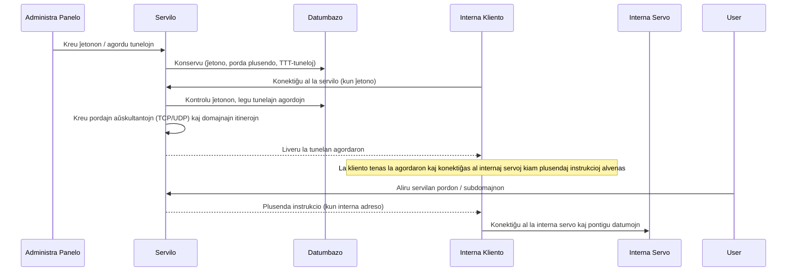

<div align="center">


## FastTunnel

[](https://www.apache.org/licenses/LICENSE-2.0)
[](https://github.com/bambuo/FastTunnel/actions)
[](https://www.nuget.org/packages/FastTunnel.Core/)

[中文文档](README.md) | [English](README.en.md)

</div>

## Kio estas FastTunnel

FastTunnel estas alt-efikeca, transplatforma ilo por retpenetrado. Per ĝi vi povas elmeti internajn retajn servojn al la publika reto, por vi mem aŭ por iu ajn.

- **TCP / UDP porda plusendado**: aliru iun ajn internan servon (mysql, redis, ssh, fora labortablo ktp.)
- **TTT-tuneloj**: aliru internajn retpaĝajn servojn per propraj domajnoj / subdomajnoj (ofte uzata por disvolvo de WeChat)
- **Enkonstruita administra panelo**: ĵetono-administrado, tunelaj agordoj, retaj klientoj, sistemaj agordoj kaj reviziaj protokoloj
- Male al aliaj penetradaj iloj, FastTunnel celas esti facile etendebla kaj facile prizorgebla kadro. Vi povas konstrui vian propran penetradan aplikaĵon per la NuGet-pakaĵo `FastTunnel.Core`.

> ⚠️ Kiam vi elmetas pordon 3389 (fora labortablo), certigu, ke via sistempasvorto estas sufiĉe forta por preventi neaŭtorizitan aliron.

## Trajtoj

- [x] Fora aliro al komputiloj en interna reto (Windows / Linux / Mac)
- [x] Aliro al internaj retpaĝaj servoj per propra domajno / subdomajno
- [x] TCP / UDP porda plusendado (dudirekta UDP-datagrama plusendo)
- [x] Pluraj domajnoj ligitaj al internaj servoj
- [x] Aŭtentigo de klientoj per ĵetono (ĵetonoj kreiĝas en la administra panelo; neaŭtorizitaj ĵetonoj estas rifuzitaj)
- [x] Servilo administras tunelajn agordojn: nula agordo ĉe la kliento, ĉio administrata en la panelo, ŝanĝoj efikas tuj
- [x] Klienta medi-raporto (sistemo / CPU / memoro / .NET-versio)
- [x] Vida sistemagordado (radika domajno, plusenda ŝaltilo, JWT ktp.; varmŝargiĝas post konservo)
- [x] Operaciaj reviziaj protokoloj
- [ ] p2p penetrado

## Arkitekturo



**Ensaluta kaj Agordo-Livera Fluado**



| Projekto | Priskribo |
|---|---|
| `FastTunnel.Server` | Servilo (uzigita sur maŝino kun publika IP), gastigas administran API-on kaj administran UI-on |
| `FastTunnel.Client` | Kliento (uzigita sur internaj maŝinoj), aktive konektiĝas al la servilo |
| `FastTunnel.Core` | Kerno-kadra biblioteko (publikigita al NuGet por sekundara disvolvo) |
| `FastTunnel.Core.Client` | Klienta kerno-biblioteko |
| `FastTunnel.Api` | Administra API (ĵetonoj, tuneloj, retaj klientoj, sistemaj agordoj, reviziaj protokoloj) |
| `FastTunnel.Admin` | Administra UI (Vue 3 + Arco Design) |

## Ekrankopioj

**Ĉefpanelo**


**Ĵetonoj** (kreiĝas en la administra panelo; klientoj devas porti validan ĵetonon por ensaluti)


**TTT-Tuneloj**


**Porda Plusendado** (TCP / UDP)


**Retaj Klientoj** (aktivaj konektoj kun medi-informo)


**Reviziaj Protokoloj**


**Sistemaj Agordoj**


## Rapida Komenco

### 1. Uzigu la servilon

```bash
# Disvolvo (aŭskultas je http://*:1270 defaŭlte)
dotnet run --project FastTunnel.Server

# Aŭ publikigu
./publish.sh
```

Servilaj datumoj estas konservitaj en `data/fasttunnel.db` (SQLite, sub la aplikaĵa dosierujo: kontoj, ĵetonoj, tunelaj agordoj, reviziaj protokoloj).

### 2. Inicializu la administran panelon

Malfermu `http://servila-ip:1270` en retumilo. Unuafoje la agorda paĝo kreas la administran konton (TOTP-dufaktora kontrolo subtenata).

### 3. Kreu ĵetonon kaj tunelojn

1. **Ĵetonoj** → kredu ĵetonon (ekz. `ft-demo-token`)
2. **TTT-Tuneloj** → kredu (subdomajno + interna servo-adreso, ligita al ĵetono)
3. **Porda Plusendado** → kredu (fora pordo + interna adreso + TCP/UDP-protokolo, ligita al ĵetono)

Tunelaj ŝanĝoj efikas tuj; se la cela kliento estas eksterreta, la agordo aplikiĝas aŭtomate kiam la kliento ensalutas.

### 4. Agordu kaj startigu la klienton

Nur tri agordoj necesas en `FastTunnel.Client/appsettings.json`:

```json
{
  "FastTunnel": {
    "Server": {
      "ServerAddr": "servila-ip-aŭ-domajno",
      "ServerPort": 1270
    },
    "Token": "ft-demo-token"
  }
}
```

```bash
dotnet run --project FastTunnel.Client
```

Post konekto, la servilo aŭtomate kreas pordajn aŭskultantojn kaj domajnajn itinerojn laŭ la administraj agordoj. Aliru internajn servojn per `servila-ip:fora-pordo` aŭ `subdomajno.radika-domajno:1270`.

### 5. Sistemaj agordoj

La paĝo **Sistemaj Agordoj** administras servilajn parametrojn (varmŝargiĝas post konservo):

- **Ŝalti pordan plusendadon**: kiam malŝaltita, la servilo ĉesas trakti pordan plusendadon
- **Radika domajno**: subdomajna sufikso por TTT-tuneloj (ekz. `test.cc`)
- **JWT-aŭtentigo**: parametroj de la ensaluta ĵetono de la administra panelo (ŝanĝoj postulas servilan rekomencon)

## Sekurecaj Notoj

- La defaŭlta JWT-subskriba ŝlosilo estas enkonstruita defaŭlto; ŝanĝu ĝin en Sistemaj Agordoj por produktado
- Ĵetonoj kaj tunelaj agordoj estas konservitaj en la servila datumbazo; protektu servilan aliron
- Uzu fortajn pasvortojn kiam vi elmetas pordojn kiel 3389 / 22

## Permesilo

Apache License 2.0
