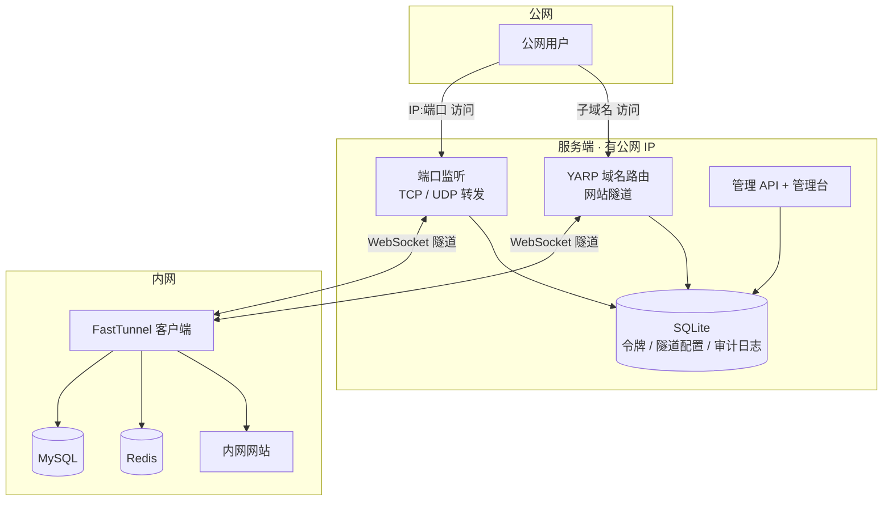
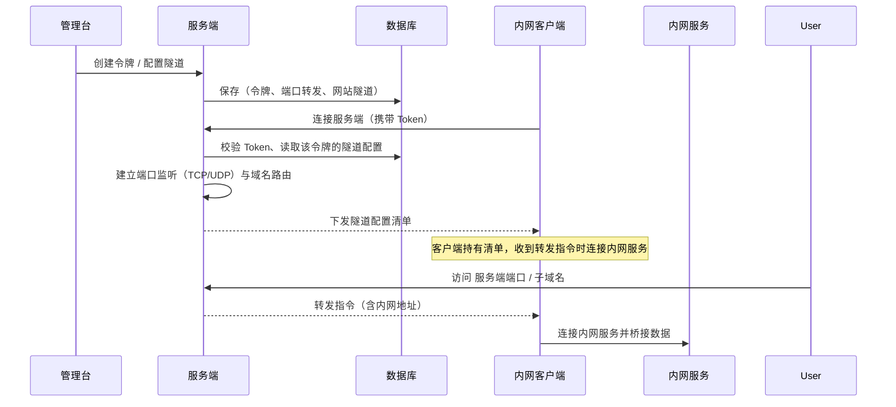
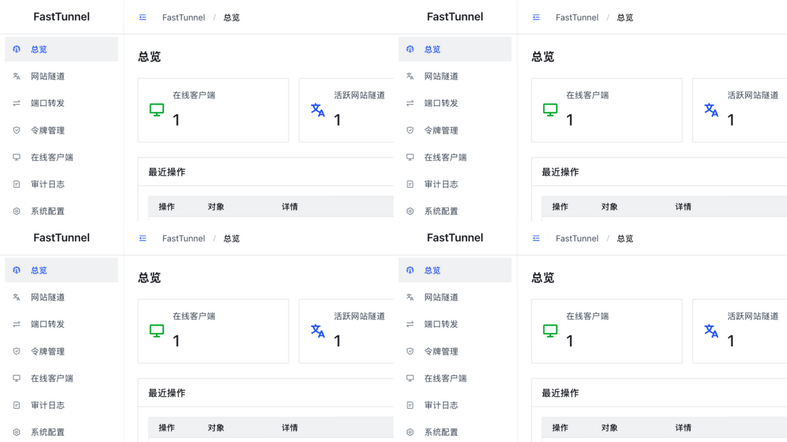
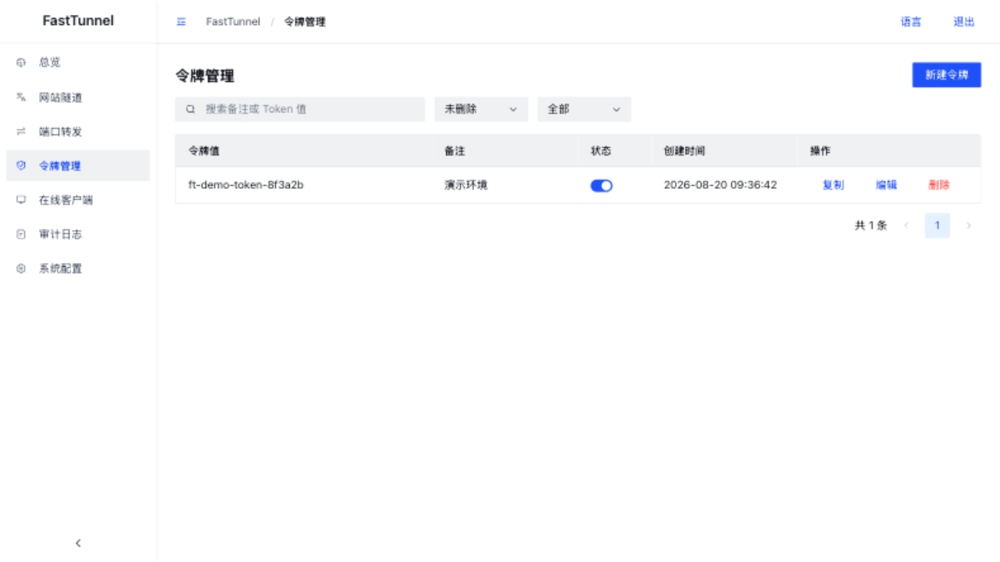
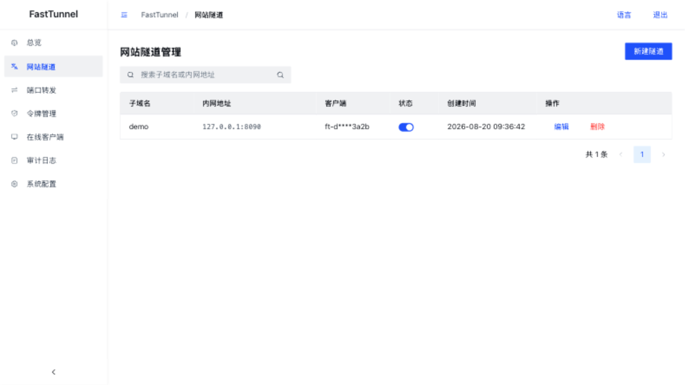
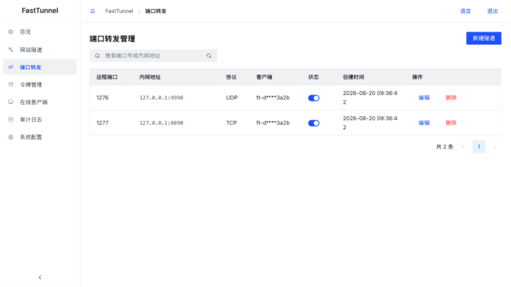
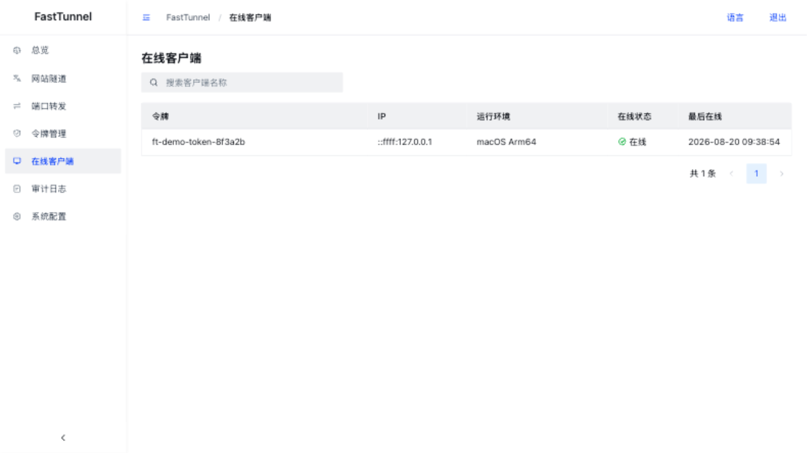
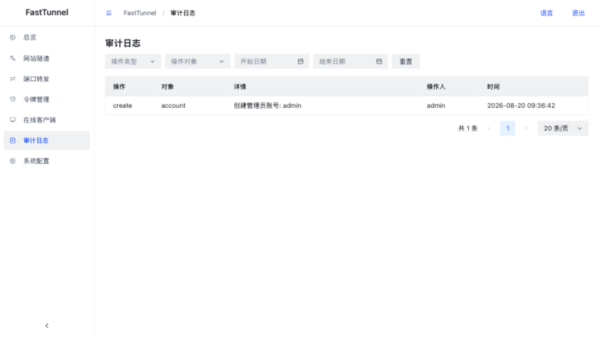
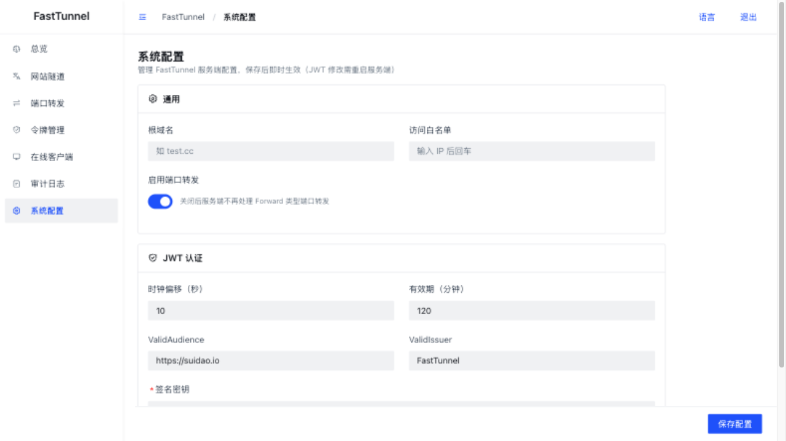

<div align="center">


## FastTunnel-内网穿透

[](https://www.apache.org/licenses/LICENSE-2.0)
[](https://github.com/SpringHgui/FastTunnel/actions)
[](https://www.nuget.org/packages/FastTunnel.Core/)

[README](README.md) | [中文文档](README_zh.md)

</div>

## FastTunnel 是什么

FastTunnel 是一个高性能跨平台内网穿透工具，使用它可以实现将内网服务暴露到公网供自己或任何人访问。

- 支持 **TCP / UDP 端口转发**：访问内网任意端口提供的服务（mysql、redis、ssh、远程桌面等）
- 支持 **网站隧道**：通过自定义域名/子域名访问内网 Web 服务（常用于微信开发调试、对外开放网站）
- 自带 **Web 管理台**：令牌管理、隧道配置、在线客户端、系统配置、审计日志全部可视化操作
- 与其他穿透工具不同的是，FastTunnel 致力于打造易于扩展、易于维护的内网穿透框架，可通过引用 `FastTunnel.Core` 的 NuGet 包构建自己的穿透应用

> ⚠️ 使用内网穿透暴露 3389 远程桌面端口时，请务必设置足够复杂的系统密码，避免被破解造成损失。

## 功能特性

- [x] 远程访问内网计算机（Windows / Linux / Mac）
- [x] 自定义域名访问内网 Web 服务
- [x] TCP / UDP 端口转发（UDP 支持数据报双向转发）
- [x] 支持绑定多个域名访问内网服务
- [x] 客户端 Token 认证（管理台创建，未授权 Token 拒绝登录）
- [x] 隧道配置服务端化：客户端零配置，配置统一在管理台维护，变更即时生效
- [x] 客户端环境信息上报（系统 / CPU / 内存 / .NET 版本）
- [x] 系统配置可视化（根域名、端口转发开关、JWT 等，保存即热生效）
- [x] 操作审计日志
- [ ] p2p 穿透

## 架构



**登录与配置下发流程**



| 项目 | 说明 |
|---|---|
| `FastTunnel.Server` | 服务端（部署在有公网 IP 的机器上），集成管理 API 与管理台静态资源 |
| `FastTunnel.Client` | 客户端（部署在内网机器上），主动连接服务端 |
| `FastTunnel.Core` | 核心框架库（可发布 NuGet 供二次开发） |
| `FastTunnel.Core.Client` | 客户端核心库 |
| `FastTunnel.Api` | 管理 API（令牌、隧道、在线客户端、系统配置、审计日志） |
| `FastTunnel.Admin` | 管理台前端（Vue 3 + Arco Design） |

## 界面截图

**总览**



**令牌管理**（Token 由管理台创建，客户端携带 Token 才能登录）



**网站隧道**



**端口转发**（TCP / UDP）



**在线客户端**（实时连接列表，含运行环境信息）



**审计日志**



**系统配置**



## 快速开始

### 1. 部署服务端

```bash
# 开发运行（默认监听 http://*:1270）
dotnet run --project FastTunnel.Server

# 或发布部署
./publish.sh
```

服务端数据存储在程序目录下的 `data/fasttunnel.db`（SQLite 单文件，包含账号、令牌、隧道配置、审计日志）。

### 2. 初始化管理台

浏览器访问 `http://服务端IP:1270`，首次使用进入初始化页面创建管理员账号（支持 TOTP 两步验证绑定）。

### 3. 创建令牌与隧道

1. **令牌管理** → 新建令牌（如 `ft-demo-token`）
2. **网站隧道** → 新建（子域名 + 内网服务地址，绑定令牌）
3. **端口转发** → 新建（远程端口 + 内网地址 + 协议 TCP/UDP，绑定令牌）

隧道配置保存后立即生效；若目标客户端离线，配置会在客户端登录时自动应用。

### 4. 配置并启动客户端

客户端配置只需三处（`FastTunnel.Client/appsettings.json`）：

```json
{
  "FastTunnel": {
    "Server": {
      "ServerAddr": "服务端IP或域名",
      "ServerPort": 1270
    },
    "Token": "ft-demo-token"
  }
}
```

```bash
dotnet run --project FastTunnel.Client
```

客户端连接后服务端会按管理台配置自动建立端口监听与域名路由，公网即可通过 `服务端IP:远程端口` 或 `子域名.根域名:1270` 访问内网服务。

### 5. 系统配置

管理台的 **系统配置** 页可管理服务端参数（保存即热生效）：

- **启用端口转发**：关闭后服务端不再处理端口转发
- **根域名**：网站隧道的子域名后缀（如 `test.cc`）
- **JWT 认证**：管理台登录令牌参数（修改后需重启服务端生效）

## 安全提示

- 服务端默认 JWT 签名密钥为内置默认值，生产部署后请在系统配置页修改
- 令牌与隧道配置均存储在服务端数据库，请保护好服务端访问权限
- 暴露 3389 / 22 等端口时，请确保系统密码足够复杂

## 文档与社区

- [GitHub](https://github.com/SpringHgui/FastTunnel) / [Gitee](https://gitee.com/Hgui/FastTunnel)
- QQ 交流群：798672272 / 935214348 / 768089177

## License

Apache License 2.0
