# FastTunnel 方案C 可行性分析与技术选型报告

## 零、从现状到目标

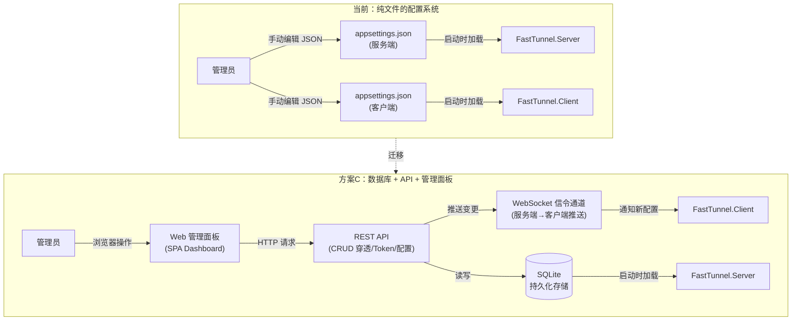

---

## 一、实现路径拆解

```mermaid
flowchart LR
    subgraph Phase1["Phase 1 · 基础设施"]
        P1A["新增 FastTunnel.Domain<br/>实体模型层"]
        P1B["新增 FastTunnel.Infrastructure<br/>EF Core + 数据库"]
        P1C["配置启动迁移<br/>自动建库建表"]
    end

    subgraph Phase2["Phase 2 · API 写操作"]
        P2A["Token CRUD API"]
        P2B["Web隧道 CRUD API"]
        P2C["Forward隧道 CRUD API"]
        P2D["客户端配置管理 API"]
    end

    subgraph Phase3["Phase 3 · 信令推送"]
        P3A["新增 MessageType 指令"]
        P3B["客户端新增 CommandHandler"]
        P3C["服务端推送变更通知"]
    end

    subgraph Phase4["Phase 4 · 管理面板"]
        P4A["Vue SPA 前端"]
        P4B["Dashboard 仪表盘"]
        P4C["隧道管理界面"]
    end

    Phase1 --> Phase2 --> Phase3 --> Phase4
```

---

## 二、技术选型

### 2.1 数据库选型

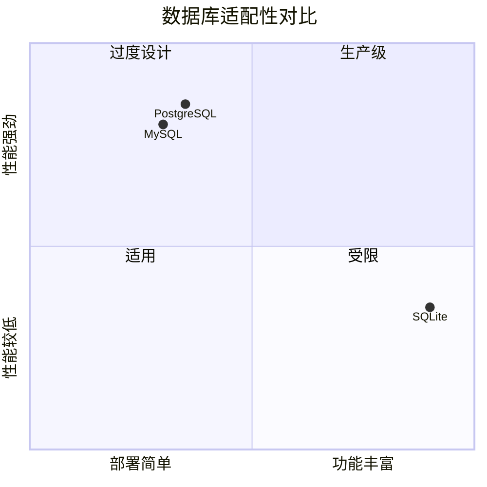

| 维度 | SQLite | PostgreSQL | MySQL |
|------|--------|------------|-------|
| 部署复杂度 | 零依赖，单文件 | 需安装服务 | 需安装服务 |
| 并发能力 | 中等 (WAL模式) | 极强 | 强 |
| .NET 10 适配 | 官方内置 | Npgsql | Pomelo |
| Docker 友好 | 单文件挂载 | 需额外容器 | 需额外容器 |
| 本项目数据量 | 万级以内 ✅ | 远超需求 | 远超需求 |

> **推荐：SQLite** — 本项目是单实例穿透服务，数据量小（百级隧道、十级客户端），SQLite 零依赖、单文件、Docker 友好，完美契合。后期如需扩展可用 `dotnet ef migrations` 一键切换到 PostgreSQL。

### 2.2 ORM 选型

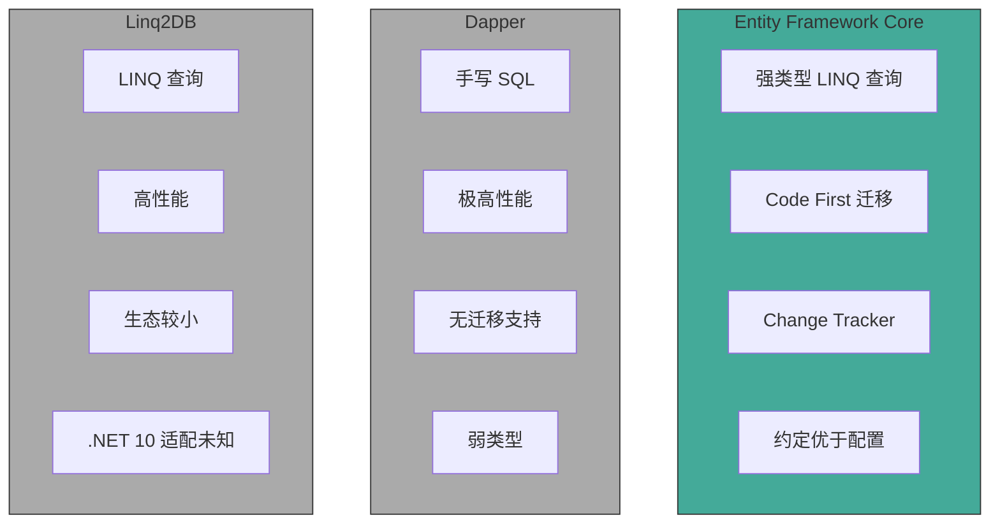

| 维度 | EF Core | Dapper | LinqToDB |
|------|---------|--------|----------|
| .NET 10 适配 | 官方 10.0 | ✅ | 需验证 |
| Code First 迁移 | `dotnet ef migrations` | ❌ | 第三方工具 |
| 与现有 DI 集成 | `AddDbContext` | ✅ | ✅ |
| 开发效率 | 最高 | 中等 | 中等 |
| 本项目查询复杂度 | 低（简单 CRUD） | 低 | 低 |
| 学习成本 | 低（.NET 开发者熟悉） | 中 | 高 |

> **推荐：EF Core** — 项目数据模型简单（5-6 张表），无需极致性能优化，EF Core 的 Code First 迁移、强类型 LINQ、与 ASP.NET Core DI 深度集成是第一选择。

### 2.3 管理面板前端选型

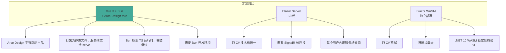

| 维度 | Vue 3 + Arco Design Vue | Blazor Server | Blazor WASM |
|------|-------------------------|---------------|-------------|
| 生态成熟度 | 极成熟 | 成熟 | 可用 |
| 部署方式 | 静态文件 (wwwroot) | 需 WebSocket | 静态文件 + API |
| 服务端压力 | 无（纯静态） | 每个用户一个连接 | 无 |
| 组件库 | Arco Design Vue | Fluent UI / MudBlazor | Fluent UI / MudBlazor |
| 打包体积 | ~200KB gzip | 无前端体积 | ~2MB+ |
| 开发人员要求 | 需 JS/TS 经验 | 纯 C# | 纯 C# |
| 本项目适配 | 已用 wwwroot 托管静态文件 | 改造大 | 改造大 |

> **推荐：Vue 3 + Bun + Arco Design Vue** — 项目已有 `wwwroot/index.html`，直接替换为 Vue SPA 静态产物即可，零服务端架构变更。Arco Design Vue 由字节跳动出品，设计语言统一。Bun 作为 JS/TS 运行时替代 Node.js，安装速度极快，原生支持 TypeScript。

---

## 三、数据模型设计

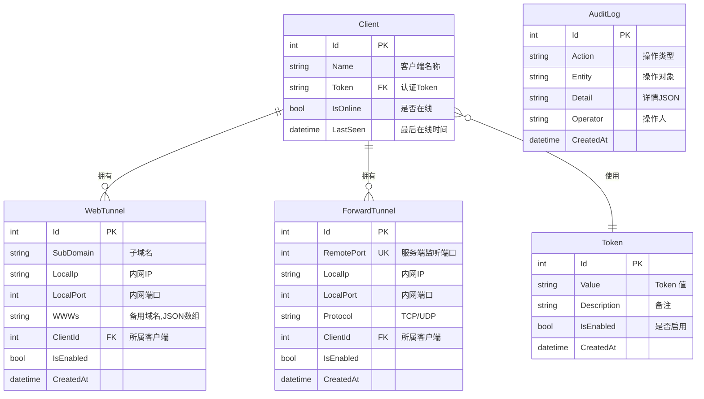

---

## 四、运行时交互流程

### 新增隧道流程

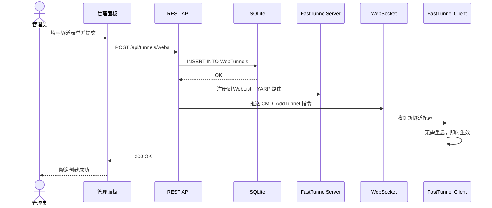

### 删除隧道流程

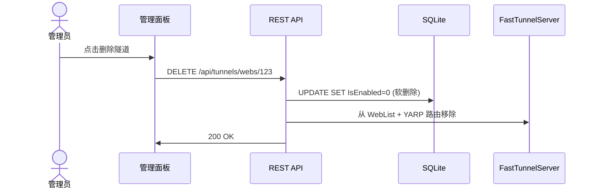

---

## 五、项目结构变更图

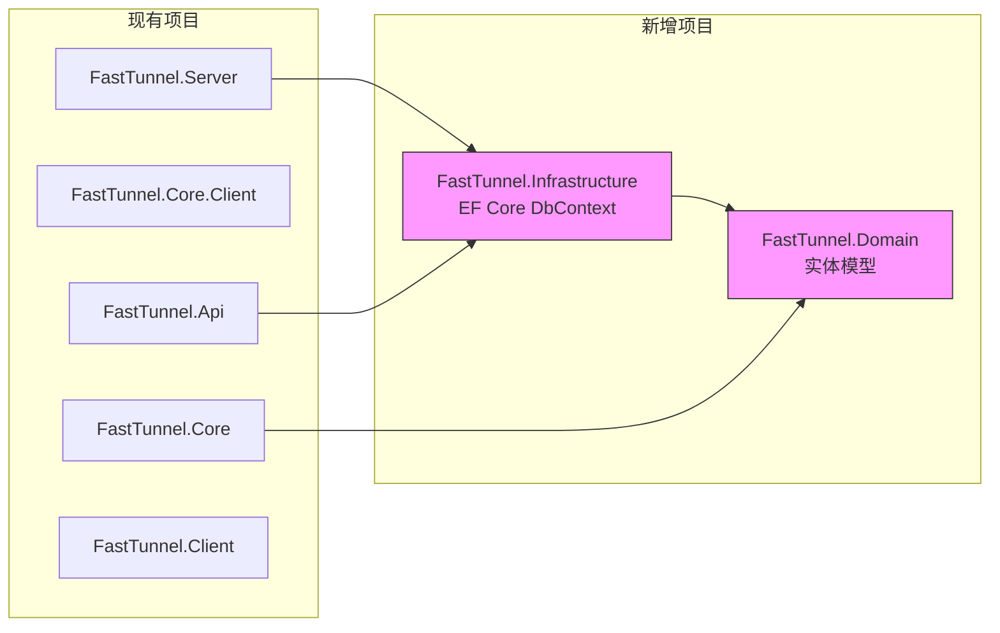

新增 NuGet 包依赖：

| 包名 | 用途 | 所在项目 |
|------|------|----------|
| `Microsoft.EntityFrameworkCore.Sqlite` | SQLite 数据库驱动 | Infrastructure |
| `Microsoft.EntityFrameworkCore.Design` | 迁移工具 (dev) | Infrastructure |
| `Microsoft.EntityFrameworkCore.Tools` | CLI 工具 (dev) | Infrastructure |

---

## 六、风险与对策

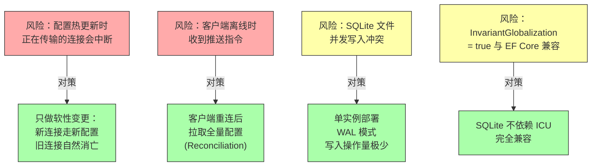

---

## 七、总体评估

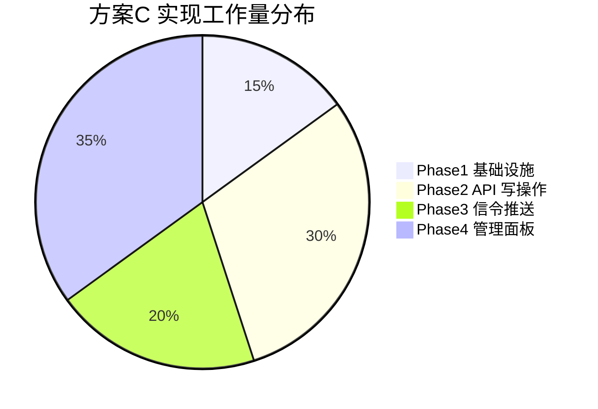

| 评估维度 | 结论 |
|----------|------|
| **技术可行性** | 完全可行，无技术阻塞点 |
| **架构兼容性** | 仅新增项目，不破坏现有代码 |
| **数据迁移** | 首次启动自动建库，配置文件作为初始种子数据 |
| **向后兼容** | 保留配置文件作为 fallback，数据库优先读取 |
| **推荐技术栈** | **SQLite + EF Core + Vue 3 + Bun + Arco Design Vue** |
| **总工作量** | 约 4 个 Phase，可迭代交付 |

---

## 八、API 接口规划

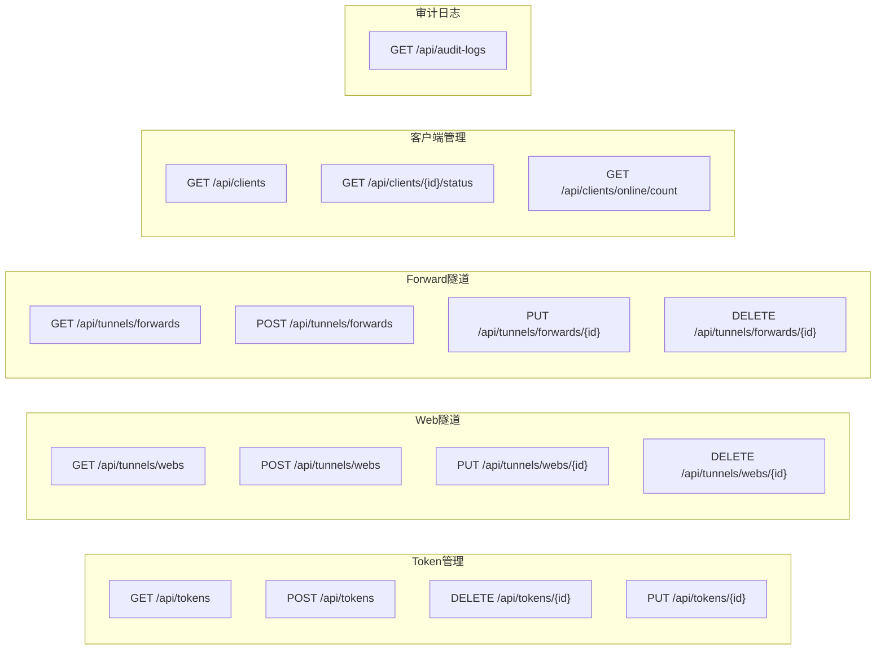

---

> **最终推荐**：方案 C 完全可行。建议从 Phase 1+2 开始，快速交付 API 管理能力，Phase 3 的信令推送让配置变更即时生效而不需重启客户端，Phase 4 的管理面板打造完整的用户体验闭环。
