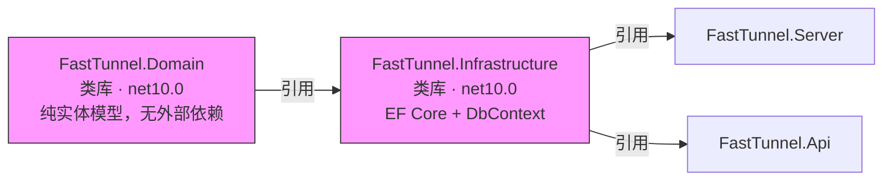
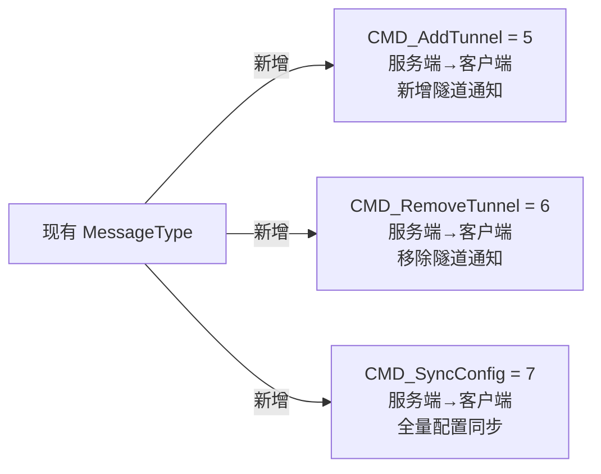
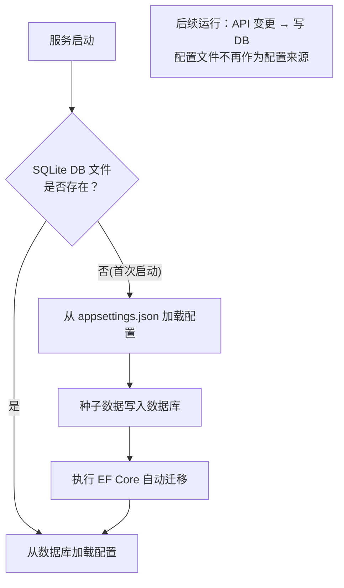
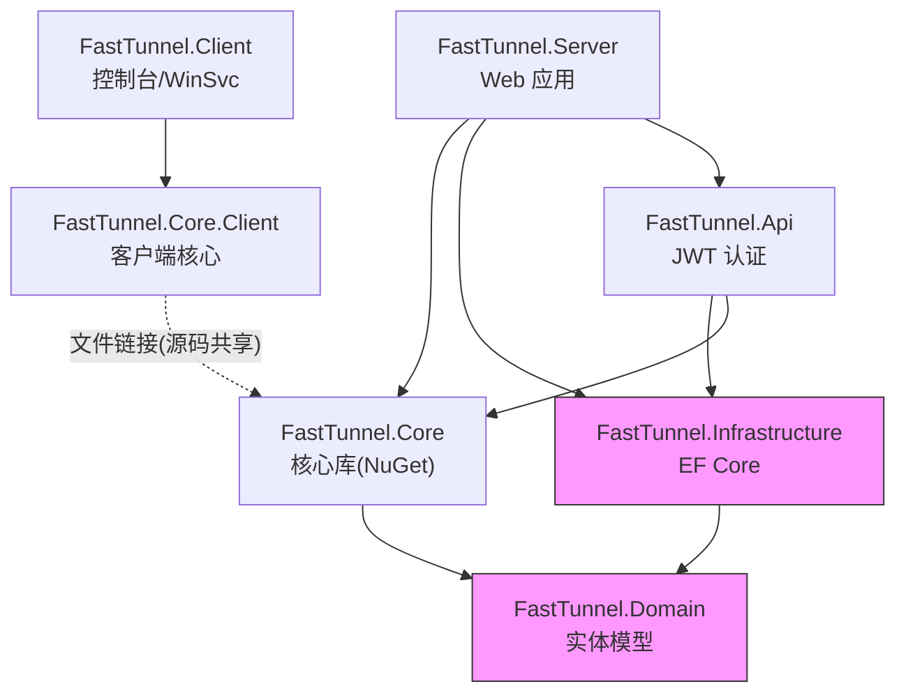

# FastTunnel 方案C — 技术选型清单

---

## 一、总体决策

| 决策项 | 最终选型 | 备选方案 | 选型理由 |
|--------|----------|----------|----------|
| 数据库 | **SQLite** | PostgreSQL / MySQL | 单实例部署、零依赖、Docker 单文件友好、数据量万级以内 |
| ORM | **EF Core 10.x** | Dapper / LinqToDB | Code First 迁移、强类型 LINQ、ASP.NET Core DI 深度集成、团队最熟 |
| 管理面板前端 | **Vue 3 + Bun + Arco Design Vue** | Blazor WASM / Blazor Server | Arco Design 字节跳动出品、设计语言统一、静态文件部署零服务端改造 |
| 运行时 & 包管理 | **Bun** | Node.js + npm/pnpm | 原生 JS/TS 运行时、内置打包器、安装速度极快、兼容 Vite |
| 前端路由 | **Vue Router 4** | — | SPA 必需 |
| HTTP 客户端 (前端) | **Axios** (或 fetch) | — | 拦截器方便统一错误处理、JWT 注入 |
| 信令通道 | **现有 WebSocket** 扩展 | SignalR | 复用现有 WS 连接，不引入新依赖 |
| 认证方案 | **现有 JWT** 扩展 | — | FastTunnel.Api 已有 JWT，不用重复造轮子 |

---

## 二、NuGet 包清单

### 新增依赖

| 包名 | 版本 | 所在项目 | 用途 |
|------|------|----------|------|
| `Microsoft.EntityFrameworkCore.Sqlite` | 10.0.* | FastTunnel.Infrastructure | SQLite 数据库驱动 |
| `Microsoft.EntityFrameworkCore.Design` | 10.0.* | FastTunnel.Infrastructure | EF Core 迁移设计时支持 |
| `Microsoft.EntityFrameworkCore.Tools` | 10.0.* | FastTunnel.Infrastructure | dotnet ef CLI 工具 |

### 现有依赖（不变）

| 包名 | 版本 | 所在项目 |
|------|------|----------|
| `Yarp.ReverseProxy` | 2.3.0 | FastTunnel.Core |
| `Serilog.AspNetCore` | 9.0.0 | FastTunnel.Server |
| `Serilog.Extensions.Hosting` | 9.0.0 | FastTunnel.Client |
| `Microsoft.AspNetCore.Authentication.JwtBearer` | 10.0.0 | FastTunnel.Server |
| `Microsoft.Extensions.Hosting.WindowsServices` | 10.0.0 | Server / Client |

---

## 三、前端包清单（Bun）

| 包名 | 用途 |
|------|------|
| `vue` ^3.5 | 核心框架 |
| `vue-router` ^4 | 前端路由 |
| `@arco-design/web-vue` ^2 | UI 组件库（Arco Design Vue） |
| `axios` ^1 | HTTP 请求 |
| `pinia` ^2 | 状态管理 |
| `vite` ^6 | 构建工具（Bun 兼容） |
| `@vitejs/plugin-vue` | Vite Vue 插件 |
| `typescript` ^5 | 类型安全 |
| `qrcode` ^1 | 二维码生成（Canvas/SVG） |

安装命令：`bun install`

---

## 四、新增项目清单



| 项目名 | 类型 | 目标框架 | 依赖 |
|--------|------|----------|------|
| `FastTunnel.Domain` | 类库 | `net10.0` | 无外部依赖（纯 POCO） |
| `FastTunnel.Infrastructure` | 类库 | `net10.0` | Domain + EF Core Sqlite |

---

## 五、数据实体清单

| 实体 | 表名 | 关键字段 | 说明 |
|------|------|----------|------|
| `TokenEntity` | `Tokens` | Id, Value, Description, IsEnabled, CreatedAt | 认证 Token 管理 |
| `WebTunnelEntity` | `WebTunnels` | Id, SubDomain, LocalIp, LocalPort, WWWs, ClientId, IsEnabled | Web 穿透配置 |
| `ForwardTunnelEntity` | `ForwardTunnels` | Id, RemotePort(UK), LocalIp, LocalPort, Protocol, ClientId, IsEnabled | TCP 端口转发 |
| `ClientEntity` | `Clients` | Id, Name, Token, IsOnline, LastSeen | 客户端注册 |
| `AuditLogEntity` | `AuditLogs` | Id, Action, Entity, Detail, Operator, CreatedAt | 操作审计 |

---

## 六、API 接口清单

### 6.0 系统初始化

| 方法 | 路由 | 说明 |
|------|------|------|
| `GET` | `/api/setup/status` | 查询系统是否已初始化 |
| `POST` | `/api/setup/init` | 首次部署创建管理员账号 |

### 6.1 Token 管理

| 方法 | 路由 | 说明 |
|------|------|------|
| `GET` | `/api/tokens` | 获取所有 Token 列表 |
| `POST` | `/api/tokens` | 新增 Token |
| `PUT` | `/api/tokens/{id}` | 修改 Token |
| `DELETE` | `/api/tokens/{id}` | 删除（软删）Token |

### 6.2 Web 隧道管理

| 方法 | 路由 | 说明 |
|------|------|------|
| `GET` | `/api/tunnels/webs` | 获取所有 Web 隧道 |
| `POST` | `/api/tunnels/webs` | 新增 Web 隧道 → 写入 DB + 注册 YARP 路由 |
| `PUT` | `/api/tunnels/webs/{id}` | 修改 Web 隧道 → 更新 DB + 重建 YARP 路由 |
| `DELETE` | `/api/tunnels/webs/{id}` | 删除 Web 隧道 → 软删 + 移除 YARP 路由 |

### 6.3 Forward 隧道管理

| 方法 | 路由 | 说明 |
|------|------|------|
| `GET` | `/api/tunnels/forwards` | 获取所有 Forward 隧道 |
| `POST` | `/api/tunnels/forwards` | 新增 Forward 隧道 → 写入 DB + 启动 PortProxyListener |
| `PUT` | `/api/tunnels/forwards/{id}` | 修改隧道 → 停止旧 Listener + 启动新 Listener |
| `DELETE` | `/api/tunnels/forwards/{id}` | 删除隧道 → 软删 + 停止 Listener |

### 6.4 客户端管理

| 方法 | 路由 | 说明 |
|------|------|------|
| `GET` | `/api/clients` | 获取客户端列表 |
| `GET` | `/api/clients/online/count` | 在线客户端数 |
| `GET` | `/api/clients/{id}/tunnels` | 某客户端的隧道列表 |

### 6.5 审计日志

| 方法 | 路由 | 说明 |
|------|------|------|
| `GET` | `/api/audit-logs` | 分页查询操作日志 |

### 6.6 统计数据（管理面板用）

| 方法 | 路由 | 说明 |
|------|------|------|
| `GET` | `/api/stats/overview` | 总览：在线客户端数、活跃隧道数、当日流量 |

---

## 七、消息协议扩展清单



| 消息类型 | 值 | 方向 | 负载 |
|----------|-----|------|------|
| `CMD_AddTunnel` | 5 | Server → Client | `{type, config}` 隧道配置 JSON |
| `CMD_RemoveTunnel` | 6 | Server → Client | `{type, id}` 隧道类型 + ID |
| `CMD_SyncConfig` | 7 | Server → Client | 全量 Web + Forward JSON |

---

## 八、管理面板页面清单

| 页面 | 路由 | 说明 |
|------|------|------|
| 初始化 | `/setup` | 首次部署：创建管理员账号 |
| 登录 | `/login` | JWT 登录页 |
| Dashboard | `/` | 总览仪表盘：在线客户端、活跃隧道、流量统计卡片 |
| Web 隧道 | `/tunnels/web` | 列表 + 新增/编辑/删除弹窗 |
| Forward 隧道 | `/tunnels/forward` | 列表 + 新增/编辑/删除弹窗 |
| Token 管理 | `/tokens` | 列表 + 新增/编辑/删除弹窗 |
| 客户端 | `/clients` | 客户端列表 + 在线状态 + 所属隧道 |
| 审计日志 | `/audit-logs` | 分页表格，操作记录 |

---

## 九、配置文件保留策略



| 场景 | 行为 |
|------|------|
| 首次启动 | 自动建库建表，从 `appsettings.json` 导入种子数据 |
| 后续启动 | 直接从数据库加载，忽略 JSON 中的隧道配置 |
| 配置文件损坏 | 不影响，数据库独立运行 |
| 数据库损坏 | 删除 `.db` 文件，重新从 JSON 种子数据恢复 |

---

## 十、完整项目引用关系



---

## 十一、清单汇总

```
✅ 数据库          → SQLite (Microsoft.EntityFrameworkCore.Sqlite)
✅ ORM            → EF Core 10.x Code First
✅ 管理面板        → Vue 3 + Bun + Arco Design Vue + TypeScript
✅ 前端状态管理    → Pinia
✅ 前端路由        → Vue Router 4
✅ HTTP 客户端     → Axios
✅ 信令推送        → 扩展现有 WebSocket 协议
✅ 认证            → 现有 JWT (FastTunnel.Api)
✅ 新增项目        → FastTunnel.Domain + FastTunnel.Infrastructure
✅ 数据表          → Tokens / WebTunnels / ForwardTunnels / Clients / AuditLogs
✅ API 接口        → 32 个 (Setup 2 + Auth 1 + MFA 3 + Token 4 + Web Tunnel 4 + Forward Tunnel 4 + Client 3 + System 4 + Audit 1 + Stats 1 + 现有 6)
✅ 消息协议        → +3 条 (CMD_AddTunnel / CMD_RemoveTunnel / CMD_SyncConfig)
✅ 管理面板页面    → 8 页
✅ 向后兼容        → 配置文件作为首次启动种子数据，数据库优先
```
