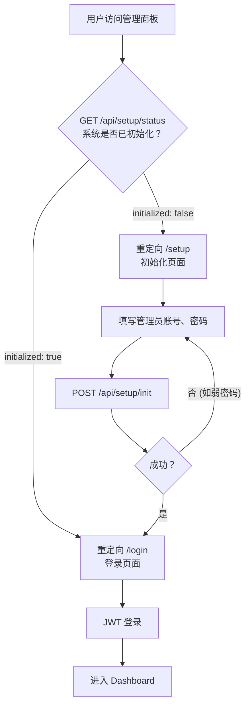
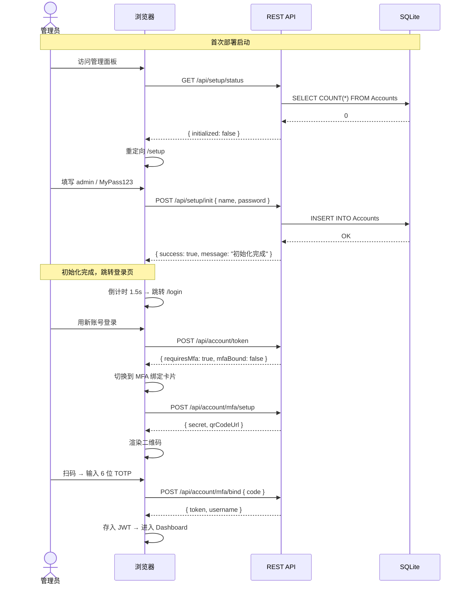
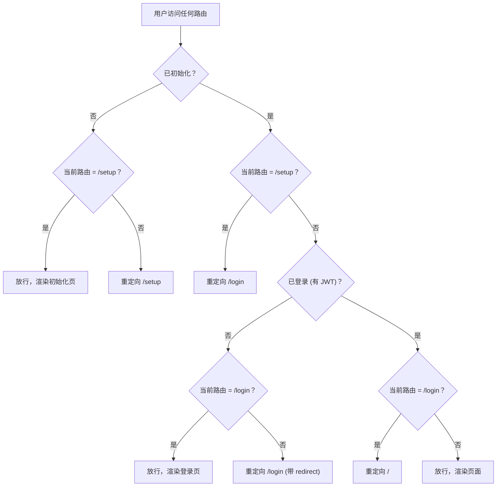
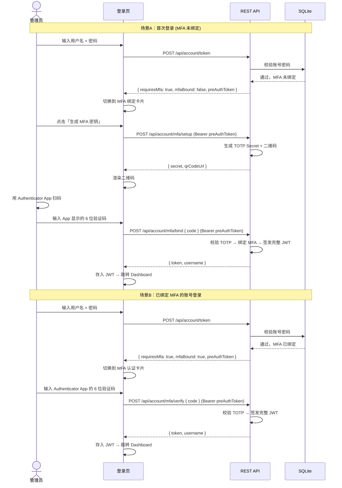
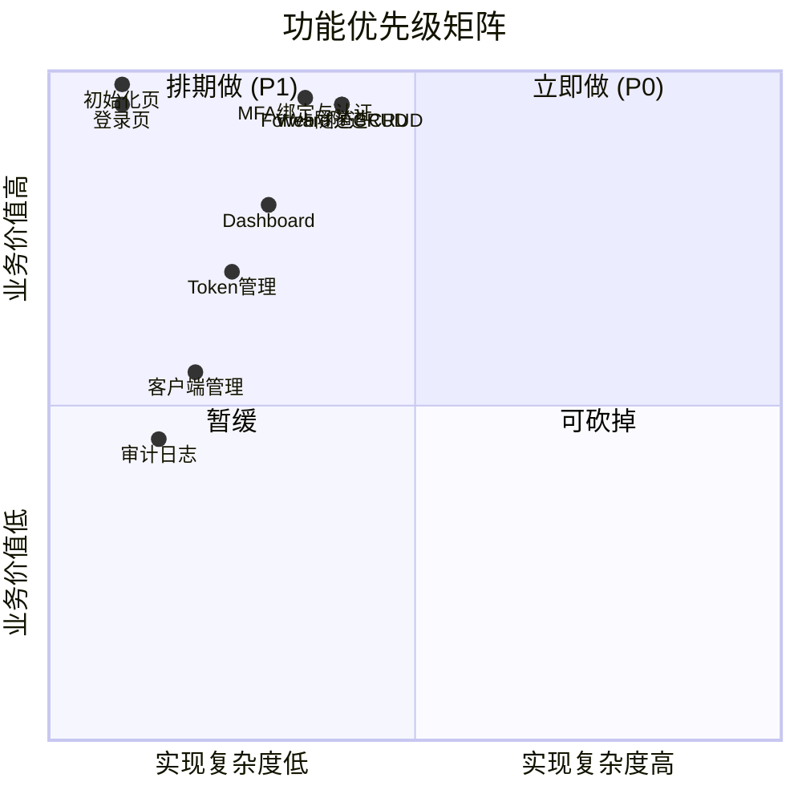

# FastTunnel 管理面板 — 前端需求文档

---

## 一、项目背景

FastTunnel 当前配置完全依赖手动编辑 JSON 文件，每次修改隧道规则需要重启服务。本管理面板作为方案C的 Phase 4 交付物，提供可视化的隧道配置管理、Token 管理、客户端监控和操作审计能力。

---

## 二、用户角色

| 角色 | 权限 | 说明 |
|------|------|------|
| 管理员 (admin) | 全部 | 唯一角色，可管理所有隧道/Token/客户端 |

---

## 三、首次部署初始化流程



**关键约束：**

| 约束 | 说明 |
|------|------|
| 仅首次运行 | 数据库中无任何管理员账号时才展示 `/setup` |
| 初始化完成后 | `/setup` 路由永远重定向到 `/login` |
| 密码强度 | 至少 8 位，含字母+数字，前端 + 后端双重校验 |
| 账号唯一 | 初始化时创建第一个管理员，后续可在 Token/账户管理中增删 |

---

## 四、功能需求

### 4.1 页面路由总览

| 路由 | 页面 | 功能简述 |
|------|------|----------|
| `/setup` | 初始化页 | 首次部署：创建管理员账号（P0） |
| `/login` | 登录页 | JWT 账号密码登录 |
| `/` | Dashboard | 总览仪表盘 |
| `/tunnels/web` | Web 隧道管理 | CRUD Web 穿透规则 |
| `/tunnels/forward` | Forward 隧道管理 | CRUD TCP 端口转发规则 |
| `/tokens` | Token 管理 | CRUD 认证 Token |
| `/clients` | 客户端管理 | 查看在线客户端及绑定关系 |
| `/audit-logs` | 审计日志 | 操作历史查询 |

---

### 4.2 初始化页 `/setup`

```
优先级: P0
路由守卫: GET /api/setup/status 返回 initialized=false 时才可访问
```

| 需求点 | 说明 |
|--------|------|
| 表单 | 管理员用户名 + 密码 + 确认密码 |
| 密码规则 | ≥ 8 位，必须包含字母和数字，前端即时校验 |
| 确认密码 | 与密码一致校验 |
| 提交 | `POST /api/setup/init` |
| 成功 | 提示"初始化完成"，1.5s 后跳转 `/login` |
| 失败 | toast 显示后端错误信息（如"密码强度不足"） |
| 重复访问 | 已初始化后访问 `/setup` → 自动跳转 `/login` |
| 无权限样式 | 全屏居中卡片，无导航栏/侧边栏 |



---

### 4.3 路由导航守卫总流程



---

### 4.4 登录页 `/login`

```
优先级: P0
```

登录页承载三个阶段的交互，按检测结果自动切换：

| 阶段 | 触发条件 | UI |
|------|----------|-----|
| 阶段1 — 账号验证 | 默认 | 用户名 + 密码表单 |
| 阶段2a — MFA 首次绑定 | 阶段1 成功后，账号**未绑定** MFA | MFA 二维码 + 6 位 TOTP 输入 |
| 阶段2b — MFA 认证 | 阶段1 成功后，账号**已绑定** MFA | 6 位 TOTP 输入 |
| 阶段3 — 完成 | 阶段2 通过后 | 跳转 Dashboard |



**阶段1 详细需求：**

| 需求点 | 说明 |
|--------|------|
| 登录表单 | 用户名 + 密码 |
| 提交 | `POST /api/account/token` |
| 成功响应 | 不再直接返回 JWT，返回 `{ requiresMfa: true, mfaBound, preAuthToken }` |
| 凭据错误 | `success: false`，显示错误信息 |
| preAuthToken | 临时令牌，仅可调用 MFA 相关接口，有效期 5 分钟 |

**阶段2a — MFA 首次绑定：**

| 需求点 | 说明 |
|--------|------|
| 二维码展示 | 使用 `` 或 Canvas 渲染 QR code URL |
| 手动密钥 | 同时显示 TOTP Secret 文本，支持一键复制（"无法扫码？手动输入"） |
| 应用提示 | 推荐 Google Authenticator / Microsoft Authenticator / Authy |
| 6 位验证码 | 输入框，自动聚焦，仅允许数字，6位自动提交 |
| 提交 | `POST /api/account/mfa/bind { code }` |
| 成功 | 返回完整 JWT → 跳转 Dashboard |
| 失败 | toast 显示"验证码错误"，不清除已生成密钥（允许重试） |
| 倒计时 | 预认证令牌 5 分钟过期，过期前 60s 显示倒计时提示 |

**阶段2b — MFA 认证：**

| 需求点 | 说明 |
|--------|------|
| 6 位验证码 | 输入框，自动聚焦，仅允许数字，6位自动提交 |
| 提交 | `POST /api/account/mfa/verify { code }` |
| 成功 | 返回完整 JWT → 跳转 Dashboard |
| 失败 | toast 显示"验证码错误，请重试" |
| 倒计时 | 同阶段2a |
| 退出登录 | "返回登录页"链接 → 回到阶段1 |

---

### 4.5 Dashboard `/`

```
优先级: P0
```

| 需求点 | 说明 |
|--------|------|
| 统计卡片 | 在线客户端数、活跃 Web 隧道数、活跃 Forward 隧道数、Token 总数 |
| 最近操作 | 展示最近 10 条审计日志摘要 |
| 数据来源 | `GET /api/stats/overview` + `GET /api/audit-logs?pageSize=10` |

---

### 4.6 Web 隧道管理 `/tunnels/web`

```
优先级: P0
```

| 需求点 | 说明 |
|--------|------|
| 列表展示 | 表格展示：子域名、内网IP:Port、自定义域名、所属客户端、状态、操作 |
| 新增 | 弹窗表单：SubDomain、LocalIp、LocalPort、WWW、ClientId |
| 编辑 | 弹窗表单，预填当前值 |
| 删除 | 二次确认弹窗，软删除（设置 IsEnabled=false） |
| 启用/禁用 | Switch 开关 |
| 搜索 | 按子域名或内网地址过滤 |
| 数据来源 | `GET/POST/PUT/DELETE /api/tunnels/webs` |

---

### 4.7 Forward 隧道管理 `/tunnels/forward`

```
优先级: P0
```

| 需求点 | 说明 |
|--------|------|
| 列表展示 | 表格展示：远程端口、内网IP:Port、协议、所属客户端、状态、操作 |
| 新增 | 弹窗表单：RemotePort、LocalIp、LocalPort、Protocol（TCP/UDP）、ClientId |
| 编辑 | 弹窗表单，预填当前值 |
| 删除 | 二次确认弹窗，软删除 |
| 启用/禁用 | Switch 开关 |
| 端口冲突校验 | 新增/编辑时检查 RemotePort 唯一性 |
| 搜索 | 按端口或内网地址过滤 |
| 数据来源 | `GET/POST/PUT/DELETE /api/tunnels/forwards` |

---

### 4.8 Token 管理 `/tokens`

```
优先级: P1
```

| 需求点 | 说明 |
|--------|------|
| 列表展示 | 表格展示：Token 值（脱敏显示）、备注、状态、创建时间 |
| 新增 | 弹窗表单：备注；Token 值可自动生成 UUID 或手动输入 |
| 编辑 | 修改备注 |
| 删除 | 二次确认（Token 被客户端引用时弹警告） |
| 启用/禁用 | Switch 开关 |
| 复制 | 一键复制完整 Token 到剪贴板 |
| 数据来源 | `GET/POST/PUT/DELETE /api/tokens` |

---

### 4.9 客户端管理 `/clients`

```
优先级: P1
```

| 需求点 | 说明 |
|--------|------|
| 列表展示 | 表格：名称、Token（脱敏）、在线状态、最后在线时间 |
| 在线状态 | 绿点/灰点 + 文字 |
| 隧道关联 | 展开行或抽屉，显示该客户端绑定的 Web/Forward 隧道 |
| 搜索 | 按名称过滤 |
| 数据来源 | `GET /api/clients` |

---

### 4.10 审计日志 `/audit-logs`

```
优先级: P1
```

| 需求点 | 说明 |
|--------|------|
| 分页表格 | 操作类型、操作对象、详情、操作人、时间 |
| 筛选 | 按操作类型、操作对象、时间范围筛选 |
| 数据来源 | `GET /api/audit-logs` |

---

### 4.11 全局交互

| 需求 | 说明 |
|------|------|
| 导航 | 侧边栏导航，当前页高亮，支持折叠 |
| 面包屑 | 顶部面包屑导航 |
| 全局异常 | API 错误统一 toast 提示 |
| 加载状态 | 表格/表单 Loading 骨架屏 |
| 空状态 | 无数据时的空状态插图 |
| 响应式 | 桌面端优先，平板可浏览 |

---

## 五、功能优先级矩阵



---

## 六、用户故事

| ID | 作为 | 我想要 | 以便 |
|----|------|--------|------|
| US-00 | 首次部署者 | 在初始化页面创建管理员账号 | 安全地完成系统首次配置 |
| US-0a | 首次部署者 | 初始化后绑定 MFA | 保护管理员账号不被盗用 |
| US-01 | 管理员 | 登录管理面板并完成 MFA 认证 | 安全访问配置功能 |
| US-02 | 管理员 | 查看仪表盘总览 | 快速了解系统运行状态 |
| US-03 | 管理员 | 创建新的 Web 隧道 | 将内网 Web 服务暴露到公网 |
| US-04 | 管理员 | 编辑已有隧道配置 | 修正错误或调整映射 |
| US-05 | 管理员 | 删除不再使用的隧道 | 回收端口和路由资源 |
| US-06 | 管理员 | 启用/禁用隧道 | 临时关闭而不删除配置 |
| US-07 | 管理员 | 创建新的 Forward 端口转发 | 通过公网访问内网 TCP 服务 |
| US-08 | 管理员 | 管理认证 Token | 控制客户端接入权限 |
| US-09 | 管理员 | 查看在线客户端 | 了解哪些客户端正在运行 |
| US-10 | 管理员 | 查看操作审计日志 | 追溯配置变更历史 |

---

## 七、非功能性需求

| 维度 | 要求 |
|------|------|
| 浏览器支持 | Chrome/Edge/Firefox/Safari 最新两个大版本 |
| 首屏加载 | ≤ 2 秒 (gzip ≤ 300KB) |
| 交互响应 | 操作反馈 ≤ 500ms |
| 部署方式 | `vite build` 产物放入 `wwwroot` 目录 |
| 兼容性 | 与 FastTunnel.Server 同版本部署 |
