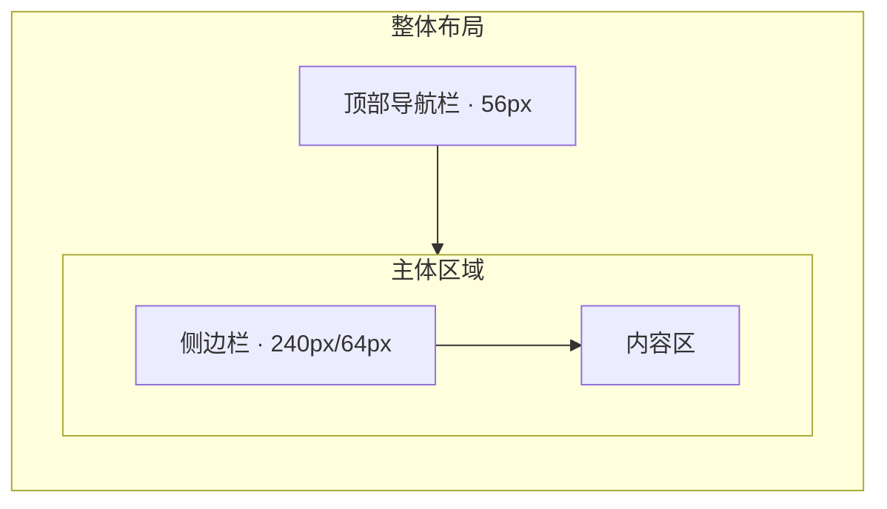

# FastTunnel 管理面板 — 前端设计规范

---

## 一、设计原则

| 原则 | 说明 |
|------|------|
| 清晰性 | 信息层次分明，操作意图明确 |
| 效率 | 高频操作 ≤ 2 次点击可达 |
| 一致性 | 同类交互模式统一，降低认知负担 |
| 克制 | 不做过度装饰，以功能为核心 |

---

## 二、布局架构



| 区域 | 尺寸 | 说明 |
|------|------|------|
| 顶部导航栏 | 高度 56px | 系统 Logo、面包屑、用户信息 |
| 侧边栏 | 展开 240px / 折叠 64px | 菜单导航，支持折叠切换 |
| 内容区 | 自适应 | 页面内容，最小宽度 900px |

---

## 三、色彩系统

### 3.1 主题色

使用 Arco Design Vue 默认主题，并通过 `<a-config-provider>` 覆盖品牌色：

| Token | 色值 | 用途 |
|-------|------|------|
| `--color-primary-6` | `#165DFF` | 主操作按钮、选中态、链接 |
| `--color-success-6` | `#00B42A` | 成功状态、在线标识 |
| `--color-warning-6` | `#FF7D00` | 警告状态 |
| `--color-danger-6` | `#F53F3F` | 危险操作、离线标识、删除按钮 |
| `--color-link-6` | `#165DFF` | 超链接文本 |

### 3.2 中性色

| Token | 色值 | 用途 |
|-------|------|------|
| `--color-text-1` | `#1D2129` | 主要文字 |
| `--color-text-2` | `#4E5969` | 次要文字 |
| `--color-text-3` | `#86909C` | 辅助文字、占位符 |
| `--color-bg-1` | `#FFFFFF` | 卡片/表格背景 |
| `--color-bg-2` | `#F2F3F5` | 页面背景 |
| `--color-border-2` | `#E5E6EB` | 分割线、边框 |

### 3.3 颜色使用规则

- 红色 (`#F53F3F`) 仅用于危险操作确认和错误状态
- 成功信息用 success 色，不自定义
- 数据看板数字颜色不超过 3 种
- Token 脱敏显示使用 `#C9CDD4` 色

---

## 四、字体排印

| 层级 | 字号 | 字重 | 用途 |
|------|------|------|------|
| H1 | 24px | 600 | 页面标题 |
| H2 | 20px | 600 | 区块标题 |
| H3 | 16px | 500 | 卡片标题、弹窗标题 |
| Body | 14px | 400 | 正文、表格内容、表单 |
| Caption | 12px | 400 | 辅助说明、时间戳 |

- 字体栈：`-apple-system, BlinkMacSystemFont, "Segoe UI", Roboto, "Helvetica Neue", Arial, sans-serif`
- 等宽字体（端口号/IP 地址等）：`"SF Mono", "Menlo", "Monaco", "Consolas", monospace`

---

## 五、间距系统

基于 4px 栅格：

| Token | 值 | 用途 |
|-------|-----|------|
| `xs` | 4px | 图标与文字间距 |
| `sm` | 8px | 表单内间距 |
| `md` | 16px | 卡片内边距、表格单元格 |
| `lg` | 24px | 内容区间距 |
| `xl` | 32px | 页面上/下边距 |

---

## 六、组件使用规范

### 6.1 表格

- 使用 `<a-table>` 组件
- 始终配置 `:pagination` 分页
- 空数据使用 `#empty` 插槽
- 加载态使用 `:loading` 属性
- 操作列固定在右侧

```vue
<a-table
  :columns="columns"
  :data="data"
  :loading="loading"
  :pagination="{ pageSize: 20, showTotal: true }"
  row-key="id"
>
  <template #action="{ record }">
    <a-space>
      <a-button type="text" size="small" @click="handleEdit(record)">编辑</a-button>
      <a-popconfirm content="确定删除？" @ok="handleDelete(record.id)">
        <a-button type="text" size="small" status="danger">删除</a-button>
      </a-popconfirm>
    </a-space>
  </template>
</a-table>
```

### 6.2 表单弹窗

- 新增/编辑统一使用 `<a-modal>` + `<a-form>`
- 表单校验使用 Arco Design 内置规则
- 提交按钮显示 loading 态，成功后关闭弹窗 + 刷新列表

```vue
<a-modal
  v-model:visible="visible"
  :title="isEdit ? '编辑隧道' : '新建隧道'"
  @ok="handleOk"
  @cancel="handleCancel"
>
  <a-form ref="formRef" :model="form" :rules="rules">
    <!-- 表单项 -->
  </a-form>
</a-modal>
```

### 6.3 统计卡片

Dashboard 使用 `<a-card>` + `<a-statistic>` 组合：

```vue
<a-row :gutter="16">
  <a-col :span="6">
    <a-card>
      <a-statistic title="在线客户端" :value="stats.onlineClients">
        <template #prefix><icon-desktop /></template>
      </a-statistic>
    </a-card>
  </a-col>
</a-row>
```

### 6.4 消息反馈

| 场景 | 组件 | 说明 |
|------|------|------|
| 操作成功 | `Message.success()` | 200ms 自动消失 |
| 操作失败 | `Message.error()` | 显示后端错误信息 |
| 删除确认 | `<a-popconfirm>` | 行内二次确认 |
| 表单警告 | `<a-alert>` | 端口冲突等行内警告 |

---

## 七、图标

- 全部使用 `@arco-design/web-vue/es/icon` 内置图标
- 常用图标映射：

| 语义 | 图标名 |
|------|--------|
| Dashboard | `IconDashboard` |
| Web 隧道 | `IconLanguage` |
| Forward 隧道 | `IconSwap` |
| Token | `IconSafe` |
| 客户端 | `IconDesktop` |
| 审计日志 | `IconFile` |
| 添加 | `IconPlus` |
| 编辑 | `IconEdit` |
| 删除 | `IconDelete` |
| 搜索 | `IconSearch` |
| 在线 | `IconCheckCircle` (success 色) |
| 离线 | `IconCloseCircle` (danger 色) |

---

## 八、响应式断点

| 断点 | 宽度 | 布局变化 |
|------|------|----------|
| Desktop | ≥ 1280px | 完整布局：侧边栏展开 + 全部列 |
| Tablet | 768px — 1279px | 侧边栏折叠，表格操作列收起到更多菜单 |
| Mobile | ≤ 767px | 仅内容区，隐藏侧边栏，表格转为卡片风格 |

---

## 九、交互微动效

| 场景 | 时长 | 缓动 |
|------|------|------|
| 侧边栏折叠 | 200ms | `cubic-bezier(0.4, 0, 0.2, 1)` |
| 弹窗打开 | 150ms | `cubic-bezier(0.34, 1.56, 0.64, 1)` |
| 弹窗关闭 | 100ms | `ease-in` |
| 开关切换 | 200ms | `cubic-bezier(0.4, 0, 0.2, 1)` |

> 微动效使用 Arco Design 组件内置动画，不额外引入动画库。

---

## 十、可访问性 (A11y)

| 要求 | 实现方式 |
|------|----------|
| 表单标签 | `<a-form-item label="xxx">` 自动关联 |
| 键盘导航 | 依赖 Arco Design 内置键盘支持 |
| 焦点管理 | 弹窗打开时焦点移到第一个输入框，关闭时回到触发按钮 |
| 色盲友好 | 状态信息配合图标和文字，不纯依赖颜色 |
