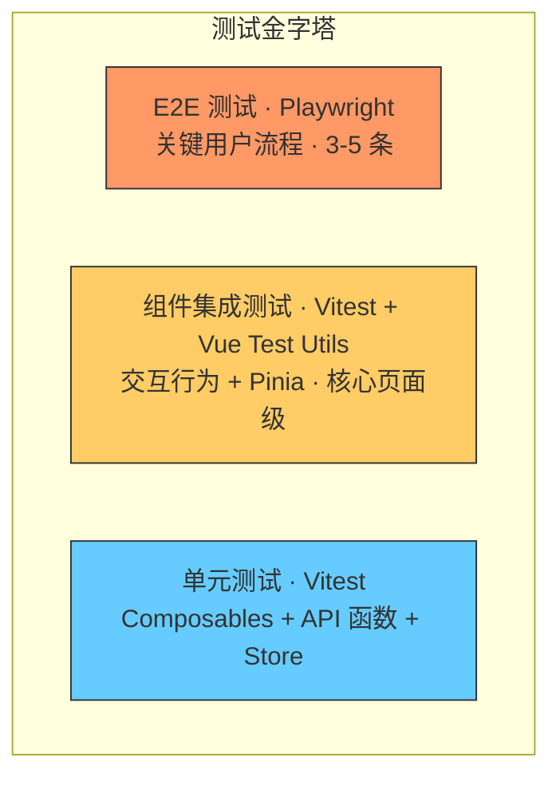

# FastTunnel 管理面板 — 前端测试规范

---

## 一、测试架构



| 层 | 工具 | 数量策略 | 运行频率 |
|----|------|----------|----------|
| 单元测试 | Vitest | 全面覆盖 composables / stores / api | 每次提交 |
| 组件集成测试 | Vitest + Vue Test Utils | 核心页面的关键交互 | 每次提交 |
| E2E 测试 | Playwright | 关键用户流程 | PR / 发布前 |

---

## 二、测试工具链

| 工具 | 版本 | 用途 |
|------|------|------|
| `vitest` | ^2 | 测试运行器 + 断言 |
| `@vue/test-utils` | ^2 | Vue 组件挂载与交互 |
| `@pinia/testing` | ^1 | Pinia Store 测试辅助 |
| `@playwright/test` | ^1 | E2E 浏览器测试 |
| `msw` | ^2 | API Mock（可选） |

安装：

```bash
bun add -d vitest @vue/test-utils @pinia/testing happy-dom
bun add -d @playwright/test
```

---

## 三、Vite 测试配置

```ts
// vite.config.ts
import { defineConfig } from 'vite'
import vue from '@vitejs/plugin-vue'
import { resolve } from 'path'

export default defineConfig({
  plugins: [vue()],
  resolve: {
    alias: {
      '@': resolve(__dirname, 'src'),
    },
  },
  test: {
    environment: 'happy-dom',
    globals: true,
    setupFiles: ['./src/test/setup.ts'],
  },
})
```

```ts
// src/test/setup.ts
import { createPinia, setActivePinia } from 'pinia'
import { beforeEach } from 'vitest'

beforeEach(() => {
  setActivePinia(createPinia())
})
```

---

## 四、单元测试规范

### 4.1 Composable 测试

**模式：** 用 `renderComposable` 辅助函数挂载 composable，验证状态变化。

```ts
// composables/__tests__/usePagination.test.ts
import { describe, it, expect } from 'vitest'
import { usePagination } from '@/composables/usePagination'

describe('usePagination', () => {
  it('初始状态 page=1', () => {
    const { page } = usePagination()
    expect(page.value).toBe(1)
  })

  it('切换页码更新 page', () => {
    const { page, onPageChange } = usePagination()
    onPageChange(3)
    expect(page.value).toBe(3)
  })

  it('切换 pageSize 时重置 page 为 1', () => {
    const { page, onPageChange, onPageSizeChange } = usePagination()
    onPageChange(5)
    onPageSizeChange(50)
    expect(page.value).toBe(1)
  })
})
```

### 4.2 Pinia Store 测试

```ts
// stores/__tests__/auth.test.ts
import { describe, it, expect, beforeEach } from 'vitest'
import { setActivePinia, createPinia } from 'pinia'
import { useAuthStore } from '@/stores/auth'

describe('useAuthStore', () => {
  beforeEach(() => {
    setActivePinia(createPinia())
    localStorage.clear()
  })

  it('默认未认证', () => {
    const store = useAuthStore()
    expect(store.isAuthenticated).toBe(false)
  })

  it('setAuth 后 isAuthenticated 为 true', () => {
    const store = useAuthStore()
    store.setAuth('test-token', 'admin')
    expect(store.isAuthenticated).toBe(true)
    expect(store.token).toBe('test-token')
  })

  it('logout 清除 token', () => {
    const store = useAuthStore()
    store.setAuth('test-token', 'admin')
    store.logout()
    expect(store.isAuthenticated).toBe(false)
    expect(store.token).toBeNull()
  })

  it('setPreAuth 设置预认证状态', () => {
    const store = useAuthStore()
    store.setPreAuth('pre-token', 'admin', true)
    expect(store.needsMfa).toBe(true)
    expect(store.mfaBound).toBe(true)
    expect(store.preAuthToken).toBe('pre-token')
  })

  it('setAuth 清除预认证状态', () => {
    const store = useAuthStore()
    store.setPreAuth('pre-token', 'admin', false)
    store.setAuth('full-token', 'admin')
    expect(store.isAuthenticated).toBe(true)
    expect(store.needsMfa).toBe(false)
    expect(store.preAuthToken).toBeNull()
  })
})
```

### 4.3 API 函数 + Mock

```ts
// api/__tests__/tunnels.test.ts
import { describe, it, expect, vi, beforeEach } from 'vitest'
import axios from 'axios'
import { getWebTunnels, createWebTunnel } from '@/api/tunnels'

vi.mock('axios')

describe('tunnels API', () => {
  beforeEach(() => {
    vi.clearAllMocks()
  })

  it('getWebTunnels 返回隧道列表', async () => {
    const mockData = { success: true, data: [{ id: 1, subDomain: 'api' }], message: null }
    vi.mocked(axios.get).mockResolvedValue({ data: mockData })

    const result = await getWebTunnels()
    expect(result.data.length).toBe(1)
  })

  it('createWebTunnel 调用 POST', async () => {
    const request = { subDomain: 'test', localIp: '127.0.0.1', localPort: 3000, clientId: 1 }
    const mockData = { success: true, data: { id: 2, ...request }, message: '创建成功' }
    vi.mocked(axios.post).mockResolvedValue({ data: mockData })

    await createWebTunnel(request)
    expect(axios.post).toHaveBeenCalledWith('/tunnels/webs', request)
  })
})
```

---

## 五、组件集成测试

### 5.1 核心原则

- **黑盒测试**：验证组件渲染输出和交互行为，不测试内部实现
- 通过 props 传入数据，通过 emit / DOM 变化验证结果
- 不 snapshot 测试（维护成本高，容易掩盖 bug）

### 5.2 视图组件测试

```ts
// views/tunnels/__tests__/WebTunnelsView.test.ts
import { describe, it, expect, vi, beforeEach } from 'vitest'
import { mount } from '@vue/test-utils'
import { setActivePinia, createPinia } from 'pinia'
import WebTunnelsView from '@/views/tunnels/WebTunnelsView.vue'
import * as tunnelsApi from '@/api/tunnels'

vi.mock('@/api/tunnels')

describe('WebTunnelsView', () => {
  beforeEach(() => {
    setActivePinia(createPinia())
    vi.clearAllMocks()
  })

  it('渲染隧道列表', async () => {
    vi.mocked(tunnelsApi.getWebTunnels).mockResolvedValue({
      success: true,
      data: [
        { id: 1, subDomain: 'api', localIp: '192.168.1.1', localPort: 8080, wwws: [], clientId: 1, isEnabled: true, createdAt: '2026-01-01' },
      ],
      message: null,
    })

    const wrapper = mount(WebTunnelsView, {
      global: {
        stubs: { RouterLink: true, RouterView: true },
      },
    })

    await vi.waitFor(() => {
      expect(wrapper.text()).toContain('api')
      expect(wrapper.text()).toContain('192.168.1.1')
    })
  })

  it('点击新建按钮打开弹窗', async () => {
    vi.mocked(tunnelsApi.getWebTunnels).mockResolvedValue({
      success: true,
      data: [],
      message: null,
    })

    const wrapper = mount(WebTunnelsView, {
      global: {
        stubs: { RouterLink: true, RouterView: true },
      },
    })

    const addBtn = wrapper.find('[data-test="add-tunnel-btn"]')
    await addBtn.trigger('click')

    expect(wrapper.find('[data-test="tunnel-modal"]').exists()).toBe(true)
  })
})
```

### 5.3 使用 `data-test` 属性

模板中为关键元素添加 `data-test` 属性，避免依赖 CSS class 或文本内容定位：

```vue
<a-button data-test="add-tunnel-btn" type="primary" @click="showModal = true">
  新建隧道
</a-button>

<a-modal data-test="tunnel-modal" v-model:visible="showModal" title="新建隧道">
  <!-- ... -->
</a-modal>

<a-table data-test="tunnel-table" :columns="columns" :data="data" />
```

### 5.4 异步交互测试

```ts
it('提交表单创建隧道后刷新列表', async () => {
  vi.mocked(tunnelsApi.getWebTunnels)
    .mockResolvedValueOnce({ success: true, data: [], message: null })
    .mockResolvedValueOnce({
      success: true,
      data: [{ id: 1, subDomain: 'new-api', localIp: '10.0.0.1', localPort: 3000, wwws: [], clientId: 1, isEnabled: true, createdAt: '2026-01-01' }],
      message: null,
    })
  vi.mocked(tunnelsApi.createWebTunnel).mockResolvedValue({
    success: true,
    data: { id: 1 },
    message: '创建成功',
  })

  const wrapper = mount(WebTunnelsView, {
    global: {
      stubs: { RouterLink: true, RouterView: true },
    },
  })

  // 打开弹窗
  await wrapper.find('[data-test="add-tunnel-btn"]').trigger('click')

  // 填写表单（用组件的 v-model）
  const form = wrapper.findComponent({ name: 'TunnelForm' })
  await form.vm.$emit('submit', {
    subDomain: 'new-api',
    localIp: '10.0.0.1',
    localPort: 3000,
    clientId: 1,
  })

  await vi.waitFor(() => {
    expect(tunnelsApi.createWebTunnel).toHaveBeenCalled()
    expect(wrapper.text()).toContain('new-api')
  })
})
```

---

## 六、Composable 测试辅助

```ts
// src/test/createTestWrapperForComposable.ts
import { createApp, defineComponent, h } from 'vue'
import { createPinia } from 'pinia'

/**
 * 创建一个 Vue 应用包装器用于测试 composable
 *
 * 用于测试依赖 provide/inject、Pinia 或 lifecycle hooks 的 composable
 */
export function withApp(fn: () => void) {
  const app = createApp({
    setup() {
      fn()
      return () => h('div')
    },
  })
  app.use(createPinia())
  const root = document.createElement('div')
  app.mount(root)
  return () => app.unmount()
}
```

---

## 七、E2E 测试规范

### 7.1 Playwright 配置

```ts
// playwright.config.ts
import { defineConfig, devices } from '@playwright/test'

export default defineConfig({
  testDir: './e2e',
  fullyParallel: true,
  retries: 2,
  webServer: {
    command: 'bun run dev',
    port: 5173,
    reuseExistingServer: true,
  },
  use: {
    baseURL: 'http://localhost:5173',
  },
  projects: [
    {
      name: 'chromium',
      use: { ...devices['Desktop Chrome'] },
    },
  ],
})
```

### 7.2 E2E 用例（核心流程）

```ts
// e2e/setup.spec.ts
import { test, expect } from '@playwright/test'

test('首次访问自动跳转到初始化页', async ({ page }) => {
  await page.goto('/')
  await expect(page).toHaveURL('/setup')
  await expect(page.locator('text=系统初始化')).toBeVisible()
})

test('完成初始化 → 登录 → MFA 绑定 → 进入系统', async ({ page }) => {
  await page.goto('/setup')
  await page.fill('input[placeholder="管理员用户名"]', 'admin')
  await page.fill('input[placeholder="管理员密码"]', 'MyPass123')
  await page.fill('input[placeholder="确认密码"]', 'MyPass123')
  await page.click('button:has-text("完成初始化")')
  await expect(page.locator('text=初始化完成')).toBeVisible()
  await expect(page).toHaveURL('/login', { timeout: 3000 })

  // 登录
  await page.fill('input[placeholder="用户名"]', 'admin')
  await page.fill('input[placeholder="密码"]', 'MyPass123')
  await page.click('button:has-text("登录")')

  // MFA 绑定卡片出现
  await expect(page.locator('text=绑定两步验证')).toBeVisible()
  await expect(page.locator('img[data-test="mfa-qr"]')).toBeVisible()
  await expect(page.locator('[data-test="mfa-secret"]')).toBeVisible()

  // 输入 TOTP（测试模式下使用固定验证码）
  await page.fill('[data-test="mfa-code-input"]', '123456')
  // 6 位自动提交
  await expect(page.locator('text=MFA 绑定成功')).toBeVisible()

  // 进入 Dashboard
  await expect(page).toHaveURL('/')
})

test('弱密码被拒绝', async ({ page }) => {
  await page.goto('/setup')
  await page.fill('input[placeholder="管理员用户名"]', 'admin')
  await page.fill('input[placeholder="管理员密码"]', '123')
  await page.fill('input[placeholder="确认密码"]', '123')
  await page.click('button:has-text("完成初始化")')

  await expect(page.locator('text=密码强度不足')).toBeVisible()
})

// e2e/mfa.spec.ts
import { test, expect } from '@playwright/test'

test('已绑定 MFA 的账号登录需验证码', async ({ page }) => {
  await page.goto('/login')

  await page.fill('input[placeholder="用户名"]', 'admin')
  await page.fill('input[placeholder="密码"]', 'MyPass123')
  await page.click('button:has-text("登录")')

  // 直接进入 MFA 验证卡片（已绑定）
  await expect(page.locator('text=两步验证')).toBeVisible()
  await expect(page.locator('[data-test="mfa-code-input"]')).toBeVisible()

  // 输入错误验证码
  await page.fill('[data-test="mfa-code-input"]', '000000')
  await expect(page.locator('text=验证码错误')).toBeVisible()

  // 重新输入正确验证码
  await page.fill('[data-test="mfa-code-input"]', '123456')
  await expect(page).toHaveURL('/')
})

test('MFA 页面可返回登录前状态', async ({ page }) => {
  await page.goto('/login')
  await page.fill('input[placeholder="用户名"]', 'admin')
  await page.fill('input[placeholder="密码"]', 'MyPass123')
  await page.click('button:has-text("登录")')

  // MFA 验证卡片
  await expect(page.locator('[data-test="mfa-code-input"]')).toBeVisible()

  // 点击「返回登录页」
  await page.click('text=返回登录页')
  await expect(page.locator('input[placeholder="用户名"]')).toBeVisible()
})

test('MFA 未绑定用户扫码后完成绑定', async ({ page }) => {
  await page.goto('/login')

  await page.fill('input[placeholder="用户名"]', 'newuser')
  await page.fill('input[placeholder="密码"]', 'MyPass123')
  await page.click('button:has-text("登录")')

  // MFA 绑定卡片
  await expect(page.locator('text=绑定两步验证')).toBeVisible()
  await expect(page.locator('img[data-test="mfa-qr"]')).toBeVisible()

  // 手动密钥可复制
  await page.click('[data-test="copy-secret-btn"]')
  // 验证码输入后自动提交
  await page.fill('[data-test="mfa-code-input"]', '654321')
  await expect(page.locator('text=MFA 绑定成功')).toBeVisible()
  await expect(page).toHaveURL('/')
})

// e2e/login.spec.ts
import { test, expect } from '@playwright/test'

test('管理员可以登录并跳转到 Dashboard', async ({ page }) => {
  await page.goto('/login')

  await page.fill('input[placeholder="用户名"]', 'admin')
  await page.fill('input[placeholder="密码"]', 'admin123')
  await page.click('button:has-text("登录")')

  await expect(page).toHaveURL('/')
  await expect(page.locator('text=在线客户端')).toBeVisible()
})

// e2e/tunnels.spec.ts
test('管理员可以创建并删除 Web 隧道', async ({ page }) => {
  // 先登录
  await page.goto('/login')
  await page.fill('input[placeholder="用户名"]', 'admin')
  await page.fill('input[placeholder="密码"]', 'admin123')
  await page.click('button:has-text("登录")')

  // 导航到隧道页面
  await page.click('text=Web 隧道')
  await expect(page).toHaveURL('/tunnels/web')

  // 新建隧道
  await page.click('button:has-text("新建隧道")')
  await page.fill('input[placeholder="子域名"]', 'e2e-test')
  await page.fill('input[placeholder="内网 IP"]', '192.168.1.1')
  await page.fill('input[placeholder="内网端口"]', '8080')
  await page.click('button:has-text("确定")')

  // 验证创建成功
  await expect(page.locator('text=e2e-test')).toBeVisible()

  // 删除隧道
  await page.click('[data-test="delete-btn"] >> nth=0')
  await page.click('button:has-text("确定")')

  // 验证删除成功
  await expect(page.locator('text=e2e-test')).not.toBeVisible()
})
```

### 7.3 E2E 覆盖矩阵

| 用例 | 优先级 | 描述 |
|------|--------|------|
| 首次访问跳转初始化 | P0 | 未初始化时访问 `/` → 重定向 `/setup` |
| 完成初始化+MFA绑定 | P0 | 初始化 → 登录 → 扫码 → TOTP 验证 → Dashboard |
| 弱密码拒绝 | P0 | 密码过短 → 显示错误提示 |
| MFA 已绑定账号登录 | P0 | 密码验证 → TOTP 输入 → 进入系统 |
| MFA 验证码错误重试 | P0 | 错误验证码 → 提示重试 |
| MFA 返回登录页 | P1 | MFA 阶段点击返回 → 回到账号密码表单 |
| 登录成功 | P0 | 正确凭据 + MFA → 跳转 Dashboard |
| 登录失败 | P0 | 错误凭据 → 显示错误提示 |
| 创建 Web 隧道 | P0 | 完整流程：打开弹窗 → 填表 → 提交 → 列表刷新 |
| 删除 Web 隧道 | P0 | 点击删除 → 确认 → 列表移除此项 |
| 创建 Forward 隧道 | P1 | 同上，附加协议选择 |
| Token 管理 | P1 | 创建 + 复制 + 删除 Token |
| 未登录拦截 | P1 | 直接访问 `/tunnels/web` → 跳转 `/login` |

---

## 八、测试运行命令

```json
{
  "scripts": {
    "test": "vitest run",
    "test:watch": "vitest",
    "test:coverage": "vitest run --coverage",
    "test:e2e": "playwright test",
    "test:e2e:ui": "playwright test --ui",
    "test:all": "bun run test && bun run test:e2e"
  }
}
```

---

## 九、测试覆盖率目标

| 维度 | 目标 |
|------|------|
| Store 语句覆盖率 | 100% |
| Composable 语句覆盖率 | 90% |
| API 层语句覆盖率 | 90% |
| 组件交互覆盖（关键路径） | 页面核心操作全覆盖 |
| E2E 覆盖 | 9 条核心用户流程 |

---

## 十、测试文件与源文件对应

```
src/
├── stores/
│   ├── auth.ts              →  stores/__tests__/auth.test.ts
│   └── tunnels.ts           →  stores/__tests__/tunnels.test.ts
├── composables/
│   └── usePagination.ts     →  composables/__tests__/usePagination.test.ts
├── api/
│   └── tunnels.ts           →  api/__tests__/tunnels.test.ts
├── views/
│   └── tunnels/
│       └── WebTunnelsView.vue → views/tunnels/__tests__/WebTunnelsView.test.ts
└── components/
    └── common/
        └── TunnelForm.vue    →  components/common/__tests__/TunnelForm.test.ts

e2e/
├── setup.spec.ts
├── mfa.spec.ts
├── login.spec.ts
├── tunnels.spec.ts
└── tokens.spec.ts
```
